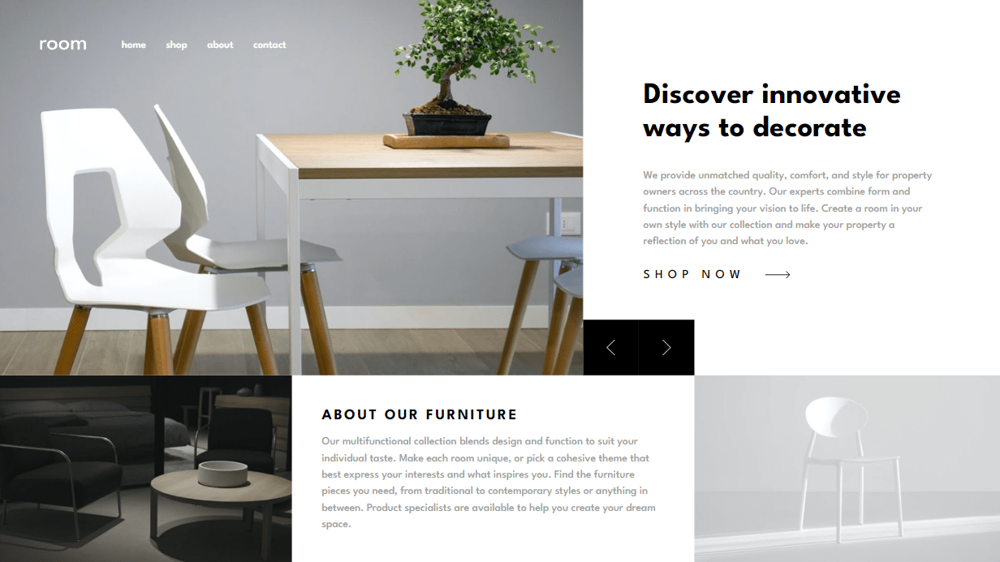

# Frontend Mentor - Room homepage solution

This is a solution to the [Room homepage challenge on Frontend Mentor](https://www.frontendmentor.io/challenges/room-homepage-BtdBY_ENq). Frontend Mentor challenges help you improve your coding skills by building realistic projects.

## Table of contents

- [Overview](#overview)
  - [The challenge](#the-challenge)
  - [Screenshot](#screenshot)
  - [Links](#links)
- [Built with](#built-with)
- [Author](#author)

## Overview

### The challenge

Users should be able to:

- View the optimal layout for the site depending on their device's screen size
- See hover states for all interactive elements on the page
- Navigate the slider using either their mouse/trackpad or keyboard

### Screenshot

### Links

- [Solution](https://www.frontendmentor.io/solutions/rome-homepage-scss-tailwindcss-uHP_8z_oG6)
- [Live site](https://resonant-axolotl-3c7113.netlify.app/)

## Built with

- Semantic HTML5 markup
- CSS custom properties
- Flexbox
- CSS Grid
- Mobile-first workflow
- [Vite](https://vitejs.dev/) - Environment set up
- [SCSS](https://sass-lang.com/) - For styles
- [Tailwind](https://tailwindcss.com/) - For styles

## Author

- Website - [Jakub Jęda](https://github.com/Jeda777)
- Frontend Mentor - [@Jeda777](https://www.frontendmentor.io/profile/Jeda777)
